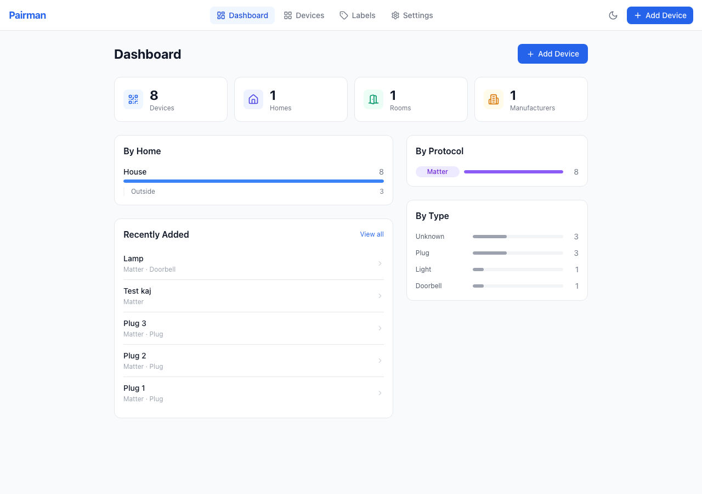
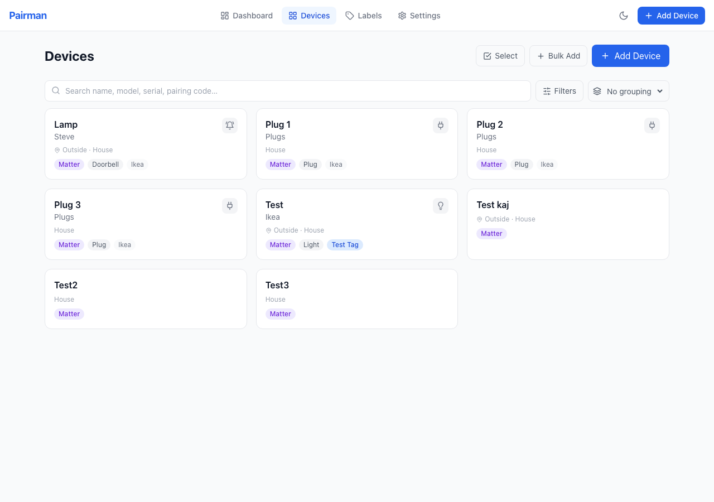
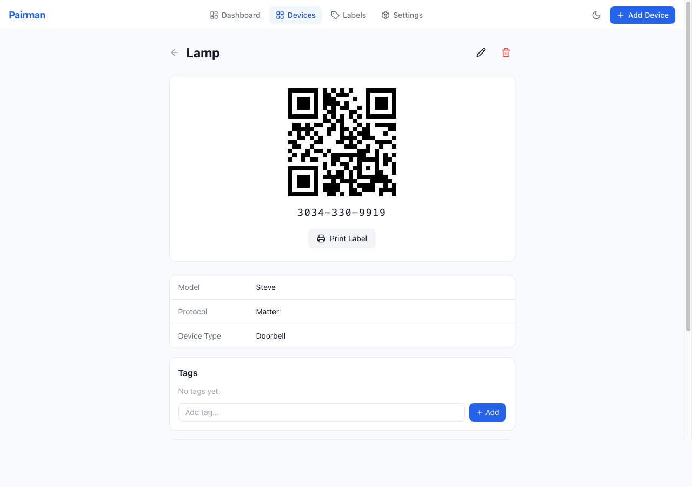
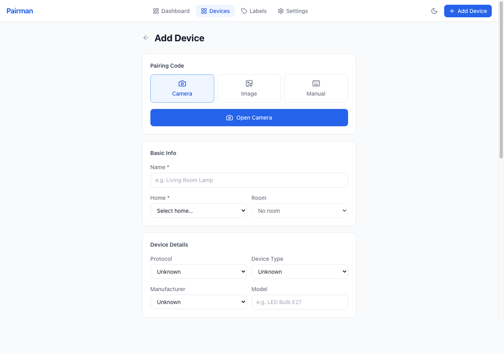
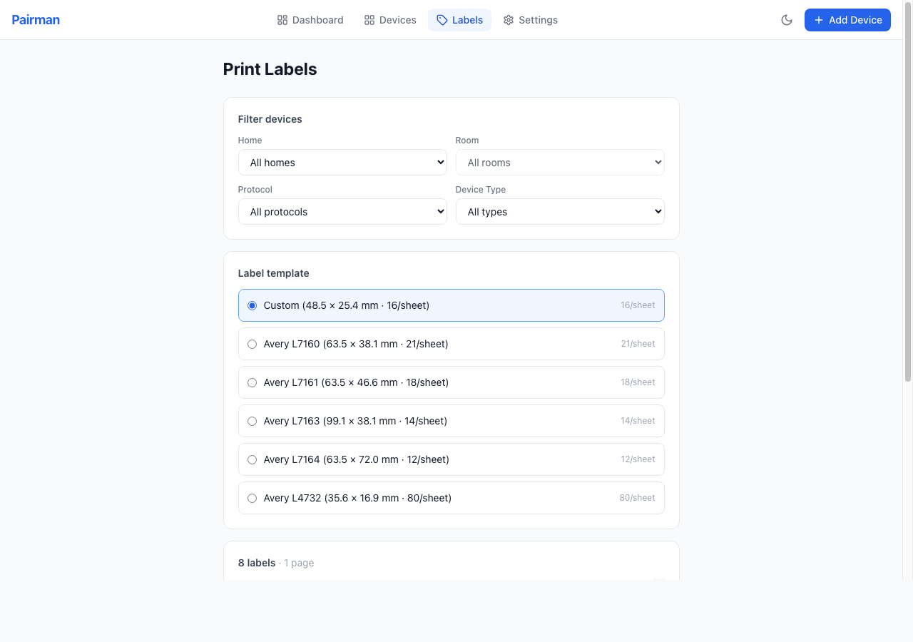
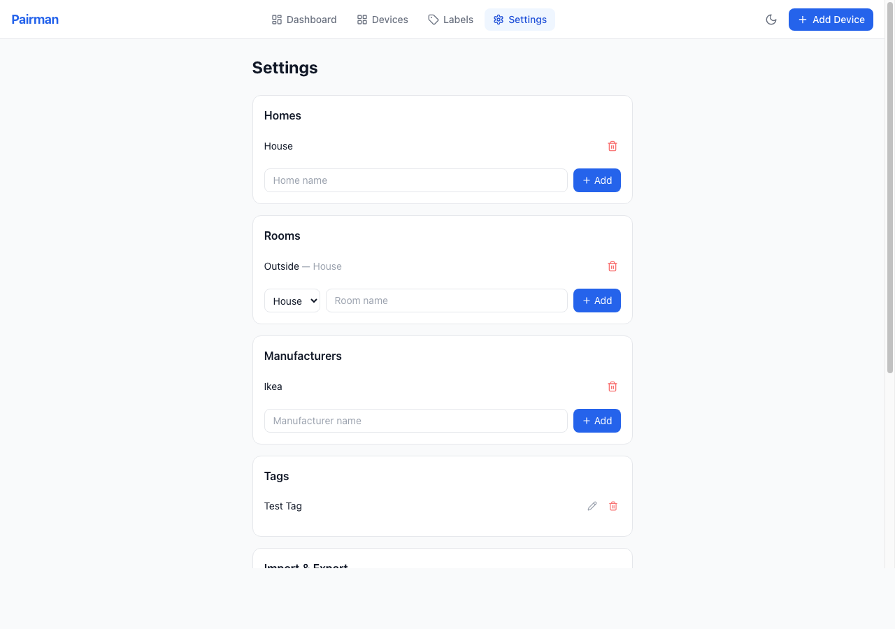

# Pairman

A self-hosted smart home pairing code manager. Store, organise, and retrieve pairing codes and QR codes for all your smart home devices — Matter, HomeKit, Z-Wave, Zigbee, and more.

Built for home users who are tired of losing the little sticker off the back of a device.

---

## Screenshots

| Dashboard | Devices |
|---|---|
|  |  |

| Device Detail | Add Device |
|---|---|
|  |  |

| Print Labels | Settings |
|---|---|
|  |  |

---

## Features

- Scan QR codes with your phone camera or upload a photo
- Automatically decodes Matter and HomeKit payloads — extracts protocol and pairing code
- Display a scannable QR code from any device's stored data (correct Matter error-correction level)
- Organise devices by home, room, manufacturer, and custom tags
- Attach photos and documents to any device
- Track purchase date, retailer, warranty expiry — with alerts when a warranty is expiring
- Custom fields for anything not covered by the standard fields
- Bulk add — scan many devices in one session with shared attributes
- Import and export as CSV or JSON
- Full database backup and restore
- Dark mode
- Mobile-friendly — works well on iPhone/iPad for scanning

---

## Quick Start (Docker)

### 1. Create a folder and download the compose file

```bash
mkdir pairman && cd pairman
curl -O https://raw.githubusercontent.com/lowryn/pairman/main/docker-compose.yml
```

Or create `docker-compose.yml` manually:

```yaml
services:
  pairman:
    image: ghcr.io/lowryn/pairman:latest
    container_name: pairman
    restart: unless-stopped
    ports:
      - "7070:8000"
    volumes:
      - ./data:/app/data
    environment:
      - TZ=Europe/London
```

### 2. Start it

```bash
docker compose up -d
```

### 3. Open in your browser

```
http://<your-server-ip>:7070
```

Data is stored in a `data/` folder next to your compose file. It persists across container restarts and updates.

---

## Updating

```bash
docker compose pull
docker compose up -d
```

---

## Configuration

All settings are via environment variables in your compose file:

| Variable | Default | Description |
|---|---|---|
| `TZ` | UTC | Timezone for date display |
| `PAIRMAN_DATA_DIR` | `/app/data` | Where the database and attachments are stored |
| `PAIRMAN_DB_URL` | SQLite (see below) | Override to use PostgreSQL |

### Using PostgreSQL instead of SQLite

```yaml
environment:
  - PAIRMAN_DB_URL=postgresql://user:pass@db:5432/pairman
```

---

## User Guide

### Setting up — Settings page

Before adding devices, set up your homes, rooms, and manufacturers under **Settings**.

- **Homes** — Add each property (e.g. "Home", "Holiday Cottage")
- **Rooms** — Add rooms and assign them to a home
- **Manufacturers** — Add brands you use (e.g. Philips Hue, IKEA, Aqara)

These are used to organise devices and to filter the device list.

---

### Adding a device

Go to **Devices → Add Device**. Choose how to enter the pairing code:

#### Scan with camera
Tap **Open Camera** and point at the QR code on the device or its box. The app decodes it automatically — for Matter and HomeKit codes, it will fill in the protocol and pairing code fields for you.

> On iPhone/iPad, the app must be accessed over HTTPS or from localhost for camera access to work.

#### Upload a photo
Choose **Upload Image** and select a photo from your library. The app scans it for a QR code. Works best with a clear, close crop of just the QR code.

#### Manual entry
Choose **Manual Entry** to type in the QR code data or pairing code directly. Useful when you only have a printed code or the camera can't read it.

#### Fill in the details
After capturing the code, fill in as much as you want:

- **Name** (required) — something memorable, e.g. "Kitchen Ceiling Light"
- **Home** (required) — which property
- **Room** — which room
- **Protocol** — auto-detected from QR code, or set manually
- **Device Type** — Light, Switch, Sensor, etc.
- **Manufacturer / Model**
- **Serial number, MAC address, firmware version**
- **Admin URL** — local IP address for the device's web interface
- **Retailer, Purchase Date, Warranty Expiry**
- **Notes**

---

### Bulk adding devices

Use **Bulk Add** when you're setting up a batch of similar devices (e.g. a set of plugs all from the same manufacturer).

1. Set the shared attributes: home, room, device type, protocol, manufacturer, retailer, model, and a name prefix
2. Scan or enter each device — it's saved immediately after each scan
3. The scanner re-opens automatically so you can scan the next one
4. A list of added devices appears below — tap **Edit** to fill in device-specific details

---

### The device page

Each device has a detail page showing:

- **QR code** — regenerated from the stored data, scannable by Matter controllers, Apple Home, etc.
- **Pairing code** — displayed in formatted groups (e.g. `3251-063-1299`)
- All device details
- **Tags** — add freeform tags to group devices across rooms and homes
- **Custom fields** — store any extra key/value information
- **Attachments** — upload photos, manuals, receipts, or any file

#### Warranty alerts
If a warranty is expired or within 30 days of expiring, a banner appears at the top of the device page. You can acknowledge and dismiss it — the dismissal is remembered in your browser.

---

### Filtering and searching devices

The device list has a filter panel with:

- Search by name
- Filter by home, room, protocol, device type, and tag
- Warranty alert filter (show only expiring/expired)

---

### Tags

Tags let you group devices across different homes and rooms. Examples: "outdoor", "security", "voice-controlled".

- Add tags from a device's detail page
- Manage (rename, delete) tags globally from **Settings → Tags**
- Renaming a tag updates it on every device that uses it

---

### Import and Export

Under **Settings → Import & Export**:

- **Export JSON / CSV** — downloads all your devices with all fields
- **Import CSV / JSON** — imports devices from a file; existing devices (matched by name + home) are skipped

CSV columns: `name, home, room, manufacturer, model, device_type, protocol, pairing_code, qr_code_data, setup_code_type, serial_number, mac_address, firmware_version, admin_url, purchase_date, retailer, warranty_expiry, notes`

---

### Backup and Restore

Under **Settings → Backup & Restore**:

- **Download Backup** — saves the raw SQLite database file to your device
- **Restore from Backup** — uploads a `.db` backup file and replaces the current database

> Restore overwrites all current data. The page reloads automatically after a successful restore.

The `data/` folder next to your compose file is also a full copy of the database — you can back this up directly.

---

### Print labels

From any device page, tap **Print Label** to generate a single PDF label with the QR code, device name, model, room, and pairing code.

From the **Labels** page you can generate a full A4 sheet of labels for a filtered set of devices. Six templates are supported:

| Template | Size | Labels/sheet |
|---|---|---|
| Custom | 48.5 × 25.4 mm | 16 |
| Avery L7160 | 63.5 × 38.1 mm | 21 |
| Avery L7161 | 63.5 × 46.6 mm | 18 |
| Avery L7163 | 99.1 × 38.1 mm | 14 |
| Avery L7164 | 63.5 × 72.0 mm | 12 |
| Avery L4732 | 35.6 × 16.9 mm | 80 |

Filter by home, room, protocol, or device type before generating. The page shows a live preview count and page estimate.

---

## Security

Pairman has **no authentication**. It is designed for use on a trusted home network only.

- Do not expose port 7070 to the internet or port-forward it through your router
- Anyone on your network with the IP and port can read, edit, or delete all your data
- The backup endpoint allows downloading the full database — keep this in mind if guests use your network
- It is completely vibe coded - there may be significant security flaws, recommended for personal local use only

---

## Building from source

```bash
git clone https://github.com/lowryn/pairman.git
cd pairman

# Build and run
docker compose -f docker-compose.yml up --build
```

Or run without Docker:

```bash
# Backend
cd backend
python -m venv .venv && source .venv/bin/activate
pip install -r requirements.txt
uvicorn app.main:app --host 0.0.0.0 --port 8000

# Frontend (separate terminal)
cd frontend
npm install
npm run dev
```

---

## Stack

- **Backend**: FastAPI, SQLAlchemy, SQLite (or PostgreSQL)
- **Frontend**: React, TypeScript, Vite, Tailwind CSS
- **QR scanning**: jsQR (browser), pyzbar (backend)
- **Deployment**: Docker, single container serving both frontend and API
